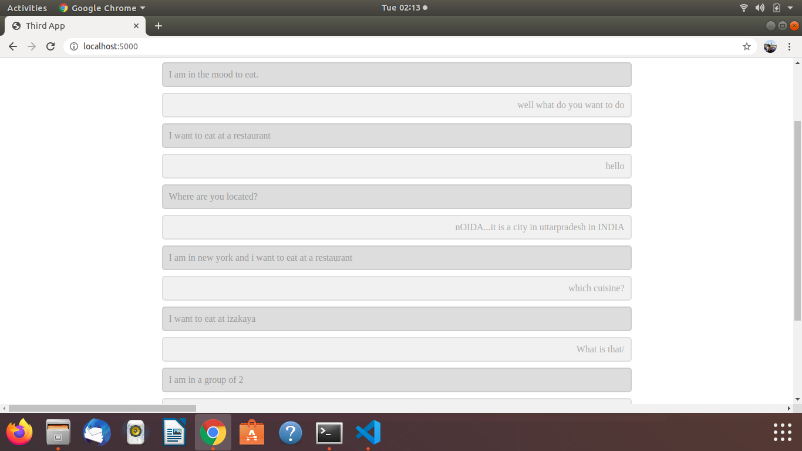

# DialoGPTWebApp

This is a basic Flask-App that provides an interface to interact with DialoGPT.

For the purpose of this project, I have pre-trained it on the DSTC8 Dataset

## Setup

```python
pytorch
flask
transformers==2.9.0
```

This was created based on DialoGPT documentation [DialoGPT](https://github.com/microsoft/DialoGPT)

## Running the files

After installing the requisite libraries, you need to downlaod the output folder in the directory. 
Hence the structure of your project should look like
```
DialoGPTWebApp
|
| ./templates
| ./output
| dstc_dialoGPT.py
| app.py
| models.py
```

The link to download the output file is [here]()

Note the bot responses appear in the gray box and user input at white box

After all that is said and done, just run
```python
python app.py
```

## Example Run

